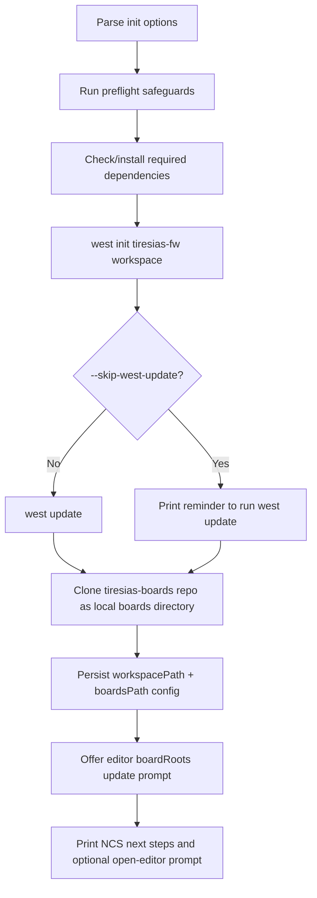
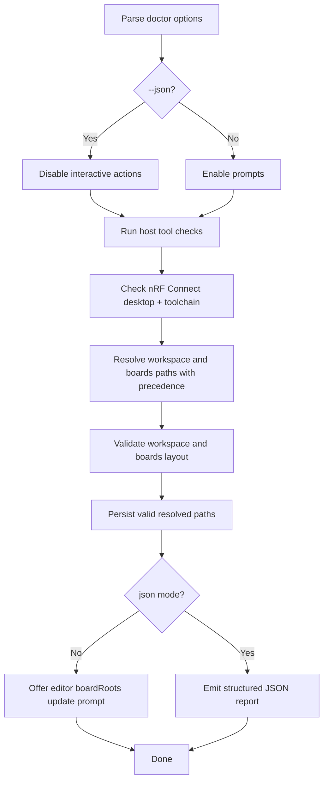

# CLI Specification

## Shared Path Resolution Rules
Path precedence for workspace/boards:
1. CLI flags
2. environment variables
3. persisted config (`~/.config/tiresias-cli/config.json`)
4. default/auto-detection

Workspace:
- flag: `--workspace`
- env: `TIRESIAS_WORKSPACE`
- config: `workspacePath`
- auto: `west topdir`

Boards:
- flag: `--boards-path`
- env: `TIRESIAS_BOARDS_PATH`
- config: `boardsPath`
- default: sibling `boards` directory next to workspace

## Global CLI Options
- `--verbose`: enables debug logs (for example, explicit subprocess command lines).
- `--quiet`: suppresses `info`/`success` output while keeping warnings and errors.
- If both are provided, `--quiet` takes precedence.

## `tiresias init`
Purpose:
- bootstrap local dependencies
- create west workspace (`tiresias-fw`)
- clone boards repository URL (`tiresias-boards`) into local `boards` directory
- persist config paths

Inputs:
- `--parent <path>` default `.`
- `--workspace-name <name>` default `tiresias-workspace`
- `--boards-name <name>` default `boards`
- `--branch <name>` default `main`
- `--force`
- `--skip-west-update`
- plus global `--verbose` / `--quiet`

Side effects:
- may install dependencies (prompts first)
- may install Homebrew on macOS (prompt first)
- may remove existing dirs when `--force`
- runs `west init`, optional `west update`
- runs `git clone` for boards repo
- writes config file
- may update editor settings (`nrf-connect.boardRoots`) after explicit prompt
- may open editor at workspace path after explicit prompt

Prompts:
- dependency install prompts (`[Y/n]`)
- Homebrew installation prompt (`[Y/n]`)
- editor settings write prompt (`[Y/n]`)
- open editor prompt (`[Y/n]`)

Outputs:
- human-readable status logs
- explicit next-step instructions for NCS extension and build target (`tiresias_dk/nrf5340/cpuapp`)

Exit codes:
- `0` success
- `1` failures (missing required tool, conflict without `--force`, command failure)

Flow:

## `tiresias doctor`
Purpose:
- validate host tools, NCS toolchain, workspace, and boards layout

Inputs:
- `--workspace <path>`
- `--boards-path <path>`
- `--json` (structured output mode, no interactive actions)
- plus global `--verbose` / `--quiet`

Side effects:
- may install missing tools on macOS (prompt first, unless `--json`)
- may clone boards repository (prompt first, unless `--json`)
- updates config when valid workspace/boards paths are resolved
- may update editor settings (`nrf-connect.boardRoots`) with prompt (non-JSON mode only)

Prompts:
- missing tool install prompts
- `nrfutil toolchain-manager` install prompt
- missing boards clone prompt
- editor settings write prompt

Outputs:
- default: colored logs
- `--json`: machine-readable JSON with checks, resolved paths (including source), overall status

Exit codes:
- `0` command completed (even if warnings/errors are reported in checks)
- `1` fatal runtime errors (unexpected exceptions/process failures)

Flow:

## `tiresias update`
Purpose:
- run `git pull` in both repositories

Inputs:
- `--workspace <path>`
- `--boards-path <path>`
- plus global `--verbose` / `--quiet`

Side effects:
- runs `git pull` in `<workspace>/tiresias-fw`
- runs `git pull` in `<boards>`
- updates persisted config with resolved paths

Prompts:
- none

Outputs:
- path resolution logs including source
- update status logs

Exit codes:
- `0` success
- `1` unresolved paths, invalid repo layout, or git failure

## `tiresias config show`
Purpose:
- display config location and persisted keys

Inputs:
- none

Side effects:
- none

Outputs:
- config file path
- persisted keys when present

Exit codes:
- `0`

## `tiresias config set`
Purpose:
- update persisted `workspacePath` and/or `boardsPath`

Inputs:
- `--workspace <path>` optional
- `--boards-path <path>` optional

Side effects:
- writes config file

Prompts:
- none

Outputs:
- confirmation log and config file path

Exit codes:
- `0` success
- `1` when both values are omitted
